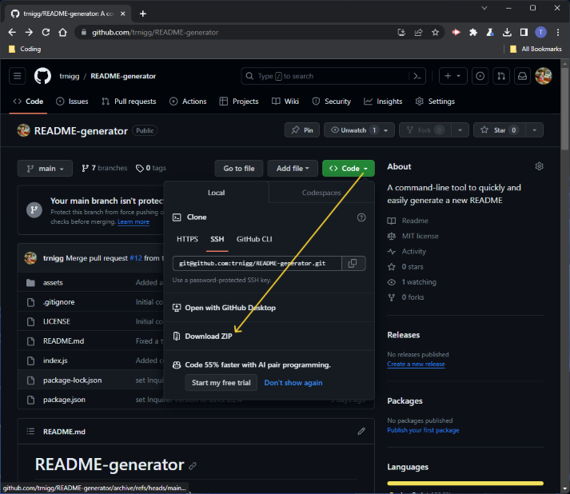
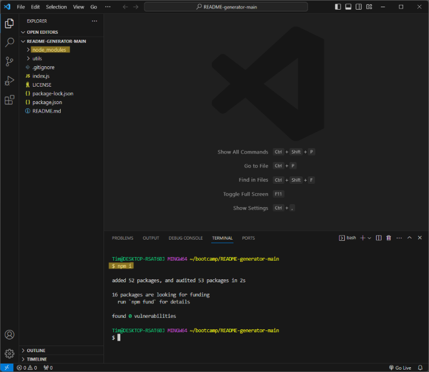

# README-generator
(```README-generator``` - Module 8 Challenge)

A command-line tool to quickly and easily generate a new README markdown file for your project.


## Description
- This application allows you to efficiently generate a new README markdown file for your project by answering a few simple prompts in the terminal!
- It will dynamically create sections and content around your answers to these prompts, as well as a **License Badge** at the top of your README (if your project has a license). 
- It is written in JS and uses the [Node.js](https://nodejs.org/en) runtime environment, while leveraging [Inquirer v8.2.4](https://www.npmjs.com/package/inquirer/v/8.2.4) for the terminal/command-line question/answer-prompt functionality.

## Installation
Before installing the application, please ensure you have installed [`Node.js`](https://nodejs.org/en) and `npm`.

To install the application: 
1. Visit [README-generator](https://github.com/trnigg/README-generator/) on GitHub.
2. Download the `.zip` of the repository and extract it to your desired directory:  

3. Navigate to the directory using the console, or open it in an integrated terminal.
4. Type `npm i` or `npm install` and hit enter in your console; this should retrieve and install the required dependancies and create a folder to store these (`./node_modules`) as depicted below:  


## Usage
To use the application: 
1. Run the application by entering `node index.js` in the console or integrated terminal, while in the directory it is stored (see [installation](#installation) above).
2. You will be met with some brief instructions that require confirmation. Type `y` and press enter if you understand and wish to continue.
3. You will then be asked a series of questions in the terminal that require an answer. Some sections are optional - these ask you to confirm with `y` or `n`.
    - Please note that all questions that require confirmation with either `y` ('yes') or `n` ('no') will default to `n` if left empty, or anything other than `y` is typed and entered.
    - Some of these sections (i.e. **Contribution** and **Tests**) will still be included if you enter `n`, but the content in these will reflect your answer.
    - The **License** section and **License Badge** *will not* be included if you explicitly answer `n` to whether your project has a license.
4. If you make a mistake and wish to restart, currently the only way to do this is by pressing `ctrl + c` on Windows or `⌘ + c` on Mac. Unfortunately, you will need to begin at **Step 1** again and none of your answers will have been saved.
5. The last questions are regarding the **license** for your project. Once you complete these, a **markdown** file titled `yourREADME.md` will be created in the directory you are in, and filled with your specified content.
    - Note: you can repeat this process from **Step 1**, but if you do not rename the generated file, or `yourREADME.md` already exists in your directory, it will overwrite the contents of the file.

>Please click [here](https://drive.google.com/file/d/1FHw_P7-TBlXn5sWdn1mgUA5lwPY8jM_-/view) to watch a video-walkthrough of the **usage** process.  
>The repo also contains the [example README](./assets/exampleREADME.md) generated in the above walkthrough.

## Roadmap / Know Bugs
The following is a non-exhaustive list of items I would like to address with more development time in the future:
### Features
- The app would benefit from a feature allowing 'advanced navigation' through the prompts, in case a mistake is made and the user wishes to go back to change a previous questions (especially the `y`/`n` confirm-questions.)
- Another beneficial feature would be to display the answers to the user in the console before generating the README, and implementing further questions thereafter that could allow a user to go through and edit answers to specific questions.
- In the future, I'd like to add more sections that can be generated and re-work the prompt sequence by initialising with a check-list that allows the user to select which sections they would like to include, before asking section-specific questions.

## License
- This project is licensed under the [MIT License](https://choosealicense.com/licenses/mit).
- Please refer to the [license](./LICENSE) section in the repo for further information.

## Questions
- For any questions, issues or feedback, please reach out to me on GitHub at [trnigg](https://github.com/trnigg/).